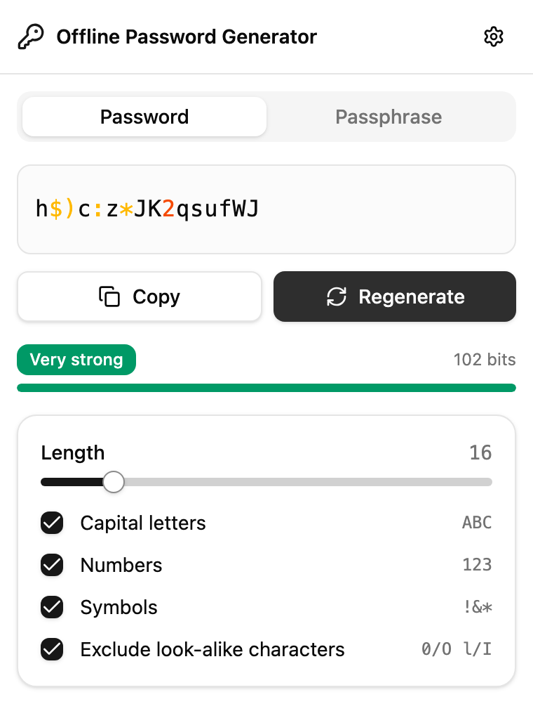
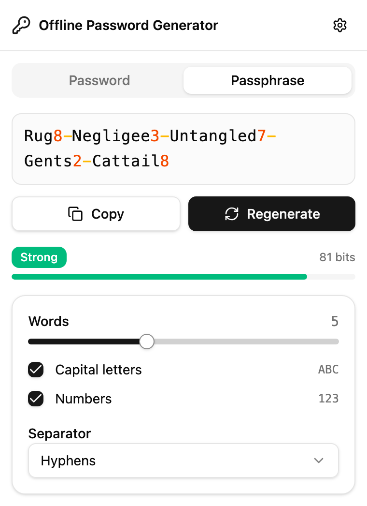
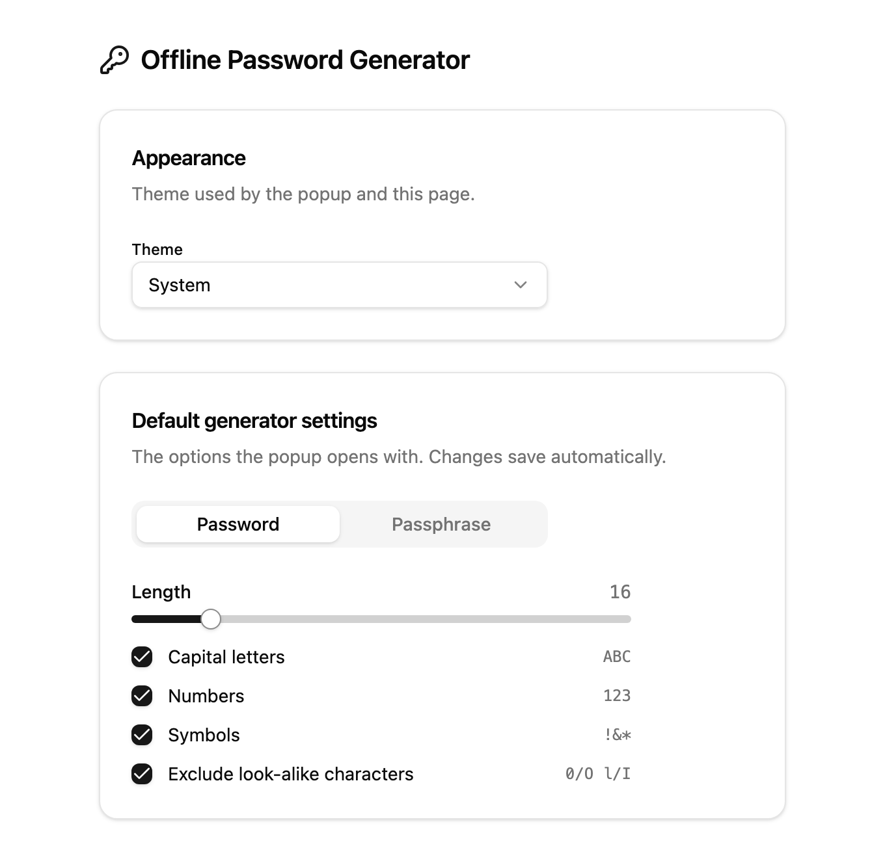

# Offline Password Generator

A local, offline Chrome extension (Manifest V3) for generating strong random
passwords and memorable [diceware](https://www.eff.org/dice) passphrases.
Everything runs in your browser - nothing is ever sent over the network.

[](https://github.com/k-adm/password-generator/actions/workflows/build.yml)
[](https://github.com/k-adm/password-generator/releases/latest)


## Screenshots

| Password | Passphrase |
|:--:|:--:|
|  |  |

<p align="center">
  
</p>

_Demo data - the generated secrets shown above are examples._

## Features

- **Two modes:**
  - **Password** - length slider (8-64), toggles for uppercase / digits /
    symbols (lowercase is always on), and an **"exclude look-alike characters"**
    option (`0`/`O`, `1`/`l`/`I`) that is **on by default**.
  - **Passphrase** - word-count slider (2-10), optional capitalization, an
    optional trailing digit per word, and a choice of separators (hyphen, space,
    period, comma, underscore, a random number, or a random number + symbol).
- **Character-by-character colored output**, one-click copy, and instant
  regeneration.
- **Strength meter** - a badge (Very weak … Very strong), a bar, and the exact
  entropy in bits. No invented crack times - see below.
- **Options page** - theme (System / Light / Dark) and default generation
  parameters. Settings persist in `chrome.storage.local` and stay in sync
  between the popup and the options page.

## Privacy & security

- **100% offline.** No network requests, no analytics, no telemetry.
- **One permission only:** `storage` (to remember your settings). No content
  scripts, no host access to any page.
- Randomness comes from the Web Crypto CSPRNG (`crypto.getRandomValues`), with
  unbiased selection via rejection sampling and a Fisher-Yates shuffle.
- Generated secrets are never persisted - only your generator settings are, and
  only on your own device. Full details in [PRIVACY.md](PRIVACY.md).

## Install

[**Add to Chrome from the Chrome Web Store**](https://chromewebstore.google.com/detail/mapgfalbmekiobemhpoanfnhnmjpajie)
- one click, and updates arrive automatically.

## Download (prebuilt)

A ready-to-use build is attached to the
[**latest release**](https://github.com/k-adm/password-generator/releases/latest)
- direct link:
[`password-generator.zip`](https://github.com/k-adm/password-generator/releases/latest/download/password-generator.zip).
Download the zip, unzip it, then in Chrome open `chrome://extensions/`, enable
**Developer mode**, click **Load unpacked**, and select the unzipped folder.

The download is rebuilt automatically on every push to `main`, so the link always
points at the current build.

## Install (from source)

```bash
npm install
npm run build        # -> dist/
```

Then load it in Chrome:

1. Open `chrome://extensions/`
2. Enable **Developer mode**
3. Click **Load unpacked** and select the `dist/` folder

## How strength is measured

For randomly generated secrets, entropy is exact rather than estimated:
`password = length x log2(pool size)`, `passphrase = words x log2(7776)` plus the
contribution of added digits and random separators. This is intentionally not
zxcvbn (which targets human-chosen, guessable passwords) - for uniformly random
secrets the mathematical entropy is the honest measure.

The meter reports that number in **bits**, and deliberately does **not** show a
"time to crack".

Any crack time has to assume a guess rate, and the real rate is set by how the
target service stores your secret - not by the secret itself. That rate spans
roughly eight orders of magnitude: on the order of 1e4 guesses/sec against bcrypt
at work factor 12, upwards of 1e12/sec against unsalted MD5 on GPUs. A generator
cannot know where its output will end up, so a single figure would be invented,
and it would rot as hardware gets faster. Bits are a property of the secret
itself, need no assumptions about the attacker, and never saturate - which is
also why the number keeps moving at every step of the slider instead of pinning
at "billions of years".

A useful intuition: each extra bit doubles the search space. The badge maps bits
to a plain-language label at 30 / 55 / 75 / 95 bits, and the bar reads full at 95
bits, where the label becomes "Very strong".

Note that entropy depends only on your **settings**, not on which words or
characters happened to come up. A five-word diceware phrase is worth the same
64.6 bits whether it reads `ox-ivy-ad-elk-ash` or
`antihistamine-configure-bookshelf-parakeet-tumbleweed` - an attacker who knows
you used diceware searches the 7776-word list, not the letters. Regenerating at
fixed settings will therefore never move the number, and that is correct.

## Wordlist

Passphrases use the **EFF large diceware wordlist** (7776 words).
Source: <https://www.eff.org/files/2016/07/18/eff_large_wordlist.txt>.
(c) Electronic Frontier Foundation, licensed **CC BY 3.0 US**. Attribution is
kept in the header of `src/lib/wordlist.ts`.

## Tech stack

Vite 7 + React 19 + TypeScript + Tailwind 4 + shadcn/ui (Radix). No runtime
dependencies for generation - it is all Web Crypto.

## Development

```bash
npm run dev          # Vite dev server (UI only, no chrome.* APIs)
npm run build        # tsc -b + eslint (--max-warnings 0) + prettier + vite build
```

Entry points: `popup.html` (generator) and `options.html` (theme + defaults).
Core logic lives in `src/lib/` (`random`, `charsets`, `password`, `passphrase`,
`wordlist`, `entropy`, `settings`).

## License

[MIT](LICENSE) (c) k-adm. The bundled EFF wordlist is CC BY 3.0 US (see above).
